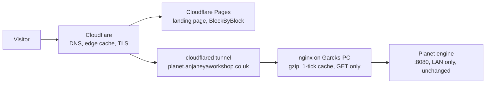

# Anjaneya Workshop: the website plan

24 Sep 2026 · Jamie · drafted from the discussion on 24 Sep 2026, for the owner's review. **Archived 24 Sep 2026:** superseded the same day by the Workshop quartet (`../process/Workshop-Strategic-Plan.md`, `Workshop-Coverage-Plan.md`, `Workshop-Active-Work.md`, `../../CLAUDE.md`) and `../decisions.md`. Kept as the record of the planning session; not edited further.

## What we are building

A dark, single-screen front door at anjaneyaworkshop.co.uk with the owner's live planet turning in the middle of it, and quiet links to the apps, each on its own subdomain. Planet goes public first, then BlockByBlock, then the two work apps once the Aviva material is out of them. Planet itself is not changed: a small front door on Garcks-PC stands between it and the internet.

Agreed in discussion on 24 Sep 2026:

- The public planet is the owner's own, experiments included. When it moves to a new build or restarts from year zero, the site follows.
- The landing page continues the viewer's own darkness outward: one screen, no scroll, the globe, one line of live numbers, the links. No hero text, no cards.
- Each app is its own room with its own character. BlockByBlock's room can be light and playful with the block graphic; the hub stays quiet.
- Apps live on subdomains (blockbyblock.anjaneyaworkshop.co.uk), not paths.
- The .co.uk is the site; the .com redirects to it.
- Hosting starts from home (75 Mbps down, 17.5 Mbps up) and moves to a rented server later, without a rebuild.
- The website gets its own repo with the same four documents Planet uses: CLAUDE.md, a brief, DECISIONS.md, PROGRESS.md.
- The name Anjaneya came with the owner's yoga-teacher qualification. The site does not need to tell that story.

## What exists today

Everything the site needs already runs or is registered; nothing is on the internet yet.

| Piece | Where it is | State on 24 Sep 2026 |
| --- | --- | --- |
| anjaneyaworkshop.co.uk | Porkbun, account Garcks, order 10139857 | Registered 22 Apr 2026, $5.66/yr, renews ~22 Apr 2027. No DNS, hosting or email set up. |
| anjaneyaworkshop.com | Porkbun, same order | Registered 22 Apr 2026, $11.08/yr, renews ~22 Apr 2027. |
| Planet (engine + viewer) | Garcks-PC (Linux Mint, i7-3820, 15 GiB, GTX 1660), `github.com/JGarcks/planet`, private | systemd user service `planet.service`; fixed build of branch `sc-option1` at 6184a69 in `~/planet-live`; seed 25660, f=32 (10,242 cells), 2.5 ticks/s; world saved every 500 ticks; HTTP on port 8080, home LAN only, GET only, no compression, `Cache-Control: no-store`. About 6 ms of CPU per tick. |
| Planet's viewer | Built into the engine binary (`viewer2d/`) | Globe by default, dark background `#0b0e14`, slow self-spin (one turn per 120 s), relief lighting, atmosphere rim, `?still` for screenshots. Uses relative `/api/...` URLs. |
| BlockByBlock | React + Three.js, all in the browser; a copy in `Desktop/BlockByBlock` on the laptop | Static files, nothing server-side. 1,168 registered blocks, 504 tests. Built to go public (rule 8: no Mojang assets). Name may have to change (see Risks). |
| ClaimsDesk, PolicyRAG | `github.com/JGarcks/ClaimsDesk`, `github.com/JGarcks/PolicyRAG`, private | Contain Aviva wordings; to be stripped and turned into demos later. PolicyRAG has a temporary cloudflared quick tunnel on port 8000. |
| Laptop (desktop-tmsridg) | Windows; Cowork's sandbox cannot reach the home LAN | Reaches GitHub over SSH with a deploy key; cannot SSH to Garcks-PC. Hand-offs go through `Desktop/for-laptop-claude.txt`. |

## The shape

A dark hub with separate rooms, and only one thing from the house on the internet: a read-only front door in front of Planet. The engine keeps listening on the home LAN alone, as the brief's section 8 says.

The landing page and BlockByBlock are static files on Cloudflare Pages, so they are up whether or not the house is. The planet is the only live thing, and it reaches the internet through nginx and a named tunnel, never directly. Cloudflare caches each tick's replies at its edge, so the house sends one copy per tick however many people are watching.

The move to a rented server later is a move of the front door, not a rebuild. Either the engine moves too (a €4 to €8 a month VPS runs it: 6 ms per tick at 2.5 ticks a second is under 2% of one core) and the tunnel goes away, or the engine stays home and only nginx moves. One DNS record changes. Which of the two is a decision for that day (WS · D7).

## The landing page

One screen, the viewer's own darkness continued outward, a planet turning, a line of live numbers, a few links. Nothing on the screen competes with the globe.

**What is on it.** The page background is the viewer's `#0b0e14` and the live viewer is framed in it with the control panel hidden, so the edge of the frame is invisible. Top left, the name, small. Under the globe, one line in a light monospace, refreshed from `/api/meta` every few seconds: the planet's age in billions of years, land share, highest peak. Then the links in the same off-white at low contrast, brightening on hover: Planet (the full viewer with its panel and History), BlockByBlock, and later ClaimsDesk and PolicyRAG. Each link carries a small mark of its own, all the same size and shape. One sentence at most, in the owner's words; none is fine.

**How it behaves.**

- The page does not scroll, so dragging the globe never fights the page. Visitors can spin it; when they let go it resumes its own slow turn.
- Before the 410 KB grid arrives, the page shows the last still it has, fading into the live picture. Nobody waits on black.
- If the house is offline, the page shows that still with "last seen at" beneath it. The site never looks broken.
- A tick number lower than the last one is a restart (the service resumes from its last save and replays up to 500 ticks). The page shows "resumed" quietly and carries on.
- On a phone the globe fills the width and the links sit beneath; the viewer already handles touch.

**What it does not do.** No new renderer: the globe is the existing viewer, which already has the relief lighting and the atmosphere rim. The brief's three.js 3D viewer stays on its own track after Layer 3, and the landing page adopts it when it exists.

## Planet's front door

nginx on Garcks-PC, about twenty lines of configuration, does everything the public side needs, and Planet's code is not touched. It sits on a local port that only the tunnel talks to, and forwards to the engine on 8080.

**What nginx does.**

- Allows GET and HEAD only; anything else gets 405 before it reaches the engine (rule 5, kept at the door as well as inside).
- Compresses replies: elevation 41 KB to 35 KB, sediment to 21 KB, plate to 1.7 KB, crust to 1.2 KB (measured by Claude on Garcks-PC).
- Holds each reply in a micro-cache for one second and collapses simultaneous misses into one fetch, so any number of viewers cost the engine one request per URL per second. It replaces the engine's `no-store` with `public, max-age=1` on the way out, so Cloudflare caches the same way at its edge. `/api/grid` is cached for a day; it never changes for a given world.
- Passes `X-Planet-Tick` through, so the page can see restarts.
- Sends `Access-Control-Allow-Origin: https://anjaneyaworkshop.co.uk`, so the landing page (a different origin, on Pages) may read `/api/meta` for its line of numbers.
- Rate-limits per address (for example 20 requests a second with a short burst) as a backstop behind Cloudflare's own protection.

**The tunnel.** A named cloudflared tunnel, installed as a systemd service, starting at boot, routing `planet.anjaneyaworkshop.co.uk` to nginx's local port. No port is opened on the router and the home address is never published. This replaces the quick tunnel that PolicyRAG uses today (quick tunnels change address on every start).

**The arithmetic.** Without the door, each viewer pulls elevation alone at about 100 KB/s uncompressed, and every viewer pulls separately; five viewers would fill the 17.5 Mbps (about 2.2 MB/s) upload. With the door, the house sends each field once per second per Cloudflare location that has a viewer: about 35 KB/s for elevation, roughly 100 KB/s for elevation plus the three river fields the viewer draws. Five busy locations would use about 0.5 MB/s, a quarter of the upload, whether ten people are watching or ten thousand.

**One visible change.** Cloudflare's cache works in whole seconds, so visitors get a new snapshot about once a second rather than every 400 ms tick. The viewer's glide (QR · D14) smooths between snapshots already, so the picture stays even; it is simply a moment further behind the engine. The owner's kiosk on the LAN is unaffected. This is WS · D4 below.

## Phases, in order

Six phases, each with a gate it must pass before the next starts. Phases 1 and 2 put the planet on the internet; everything after is additive. "Laptop Claude" is this Cowork session; "PC Claude" is Claude Code on Garcks-PC; hand-offs go through the Desktop note until the two can talk directly.

| Phase | What is built | Who | Gate |
| --- | --- | --- | --- |
| 0. Ground | Website repo `anjaneyaworkshop` on GitHub with its four documents and this plan as its brief. Cloudflare account; the two domains' nameservers pointed at Cloudflare from Porkbun; DNS records; `.com` redirecting to `.co.uk`. | Owner (accounts, nameservers), laptop Claude (repo, docs) | `https://anjaneyaworkshop.co.uk` and the `.com` both answer with a holding page over HTTPS; the `.com` redirects. |
| 1. Planet's front door | nginx config and the named tunnel on Garcks-PC, both as systemd services; the brief's section 8 amended (WS · D1); the front door recorded in Planet's DECISIONS. | Laptop Claude writes the config and the runbook; PC Claude installs and starts it | `https://planet.anjaneyaworkshop.co.uk/` shows the live viewer from outside the house (phone on mobile data). `curl -I` shows gzip, `max-age=1`, `X-Planet-Tick`; a POST gets 405; the engine's own logs show about one request per URL per second while several browsers watch. |
| 2. The landing page | The dark hub on Cloudflare Pages: framed viewer, live line of numbers, links, the still fallback, the restart and offline behaviours. Deployed from the repo on every push to `main`. | Laptop Claude | The owner opens it on the laptop and a phone and says what they saw. Load under 2 s to first picture on the home connection. Unplugging Garcks-PC's network for a minute shows the still and "last seen", then recovers by itself. |
| 3. BlockByBlock | Its own room at `blockbyblock.anjaneyaworkshop.co.uk` on Pages, built from its repo; the block graphic as its emblem; a mark for it on the hub. The name question (WS · D5) settled first, because it fixes the subdomain. | Laptop Claude, from the repo the owner names | A schematic drops in and a guide builds, on the public address, on the laptop and a phone. The 504 tests pass in the deploy. |
| 4. The rented server | A VPS (Hetzner or similar, Europe); the front door moved, and either the engine with it or not (WS · D7); the tunnel retired if the engine moves. A runbook for the move and for the move back. | Owner (account, cost), laptop Claude (setup scripts, runbook), PC Claude (the hand-over of the world file if the engine moves) | Same gate as phase 1, from the new address, and the home PC switched off for an hour with the site unchanged. |
| 5. The work apps | ClaimsDesk and PolicyRAG stripped of Aviva material, made into demos, each in its own room. | Owner (what to strip), laptop Claude | Nothing Aviva-branded or Aviva-worded in the deployed files, checked by a search of the build output; the owner's sign-off on each. |

## Decisions for the owner

Numbered WS · D1 onward, the website's own series. "Agreed" means said in the discussion on 24 Sep 2026 and recorded here; the rest wait for the owner's word. Each goes into the website repo's DECISIONS.md, and D1 into Planet's as well.

| ID | Decision | Trade-off | Status |
| --- | --- | --- | --- |
| WS · D1 | Amend Planet's brief, section 8: the engine stays on the home LAN only; a read-only front door (nginx, GET only, behind a tunnel) is the one thing on the internet. | Keeps the letter of rule 5 and most of the spirit of section 8. The alternative, no public view, is the site without its planet. | Proposed |
| WS · D2 | The public planet is the owner's own, experiments included; the site follows its restarts and moves. | Honest and simple. A visitor may catch a restart or a new world; the page says so quietly. A second, stable instance can be added later in one line of nginx. | Agreed |
| WS · D3 | The landing page frames the existing viewer; no new renderer. | Nothing to maintain twice and nothing that pre-empts the brief's 3D viewer. The look is the viewer's look. | Agreed |
| WS · D4 | Replies cached for one second at the door and the edge, so visitors see about one snapshot a second instead of 2.5. | Home upload stays under a quarter used at any audience. The picture runs a moment further behind; the glide keeps it even. Sub-second caching at the edge is not on Cloudflare's free plan. | Proposed |
| WS · D5 | BlockByBlock is renamed before it goes public, because Mojang uses "Block by Block" (its foundation with UN-Habitat). | A new name costs a few hours of find-and-replace and a subdomain; keeping the old one risks a trademark letter once the app is public. Candidates are the owner's to choose. | Owner to decide |
| WS · D6 | Subdomains for the apps; `.co.uk` is the site; `.com` redirects. | One place to remember; each app independent. | Agreed |
| WS · D7 | On the rented server: move the engine there, or move only the front door and leave the engine home. | Moving it makes the site independent of the house and costs a VPS; rule 4's hash may diverge on a different CPU. Leaving it keeps the owner's kiosk and experiments as they are and keeps the tunnel. Decide at phase 4 with the numbers then. | Deferred |
| WS · D8 | Cloudflare for DNS, edge cache, TLS, Pages and the tunnel. | One provider for the lot, all on the free plan; leaving it later means moving DNS and the tunnel. The alternative, Porkbun DNS and a port opened at home, exposes the home address and gives no cache. | Proposed |
| WS · D9 | The website repo works under the same habits as Planet: the four documents, Claude makes the commits, decisions recorded, no history rewriting, every file explains itself. | The owner reads one way of working, not two. | Agreed |

## Risks and notes

None of these blocks phases 1 or 2; the name question blocks phase 3.

- **The BlockByBlock name.** "Block by Block" is [the Mojang, Microsoft and UN-Habitat programme](https://www.blockbyblock.org/about/) that uses Minecraft for public-space design, run by the [Block by Block Foundation](https://www.blockbyblock.org/) and listed on the [Minecraft Wiki](https://minecraft.wiki/w/Block_by_Block). A public app with the same name, about Minecraft, invites a complaint. Rename before phase 3 (WS · D5); the subdomain, the repo and the how-it-works page all take the new name.
- **Minecraft imagery.** The block graphic reads as Minecraft's grass block and pickaxe. On the app's own page, about Minecraft schematics, that is fair description; it should not become the site's brand or appear on the hub beyond a small mark. The app's rule 8 (no Mojang textures in the repo) stands.
- **Determinism on another machine.** Rule 4 promises the same hash on Garcks-PC only. A world file resumed on a VPS may diverge from that point. Harmless for a public view; recorded in DECISIONS if the engine moves (WS · D7), and the golden-seed test run on the new machine first, as the queued idea already says.
- **Home uptime.** Until phase 4, the planet is down when the house is: power, router, a reboot. The landing page's still and "last seen" cover it. The service starts at boot and the tunnel will too.
- **Security.** Nothing on the public side can write: GET and HEAD only at nginx, and the engine refuses everything but GET anyway. No account, no form, no database on the site. Cloudflare's free bot protection and nginx's rate limit cover floods; the worst case is a cache-busting query string, which nginx ignores by caching on the path alone.
- **Restarts.** A restart replays up to 500 ticks (about 3 minutes at 2.5 ticks a second), so the tick number steps back. The page and anything else downstream treat a lower `X-Planet-Tick` as a restart, never an error.
- **The world moves at the owner's word.** New builds, new seeds and restarts from year zero are part of the project. The site shows whatever is on 8080; the plan does not ask the owner to change how they work.
- **Aviva material.** ClaimsDesk and PolicyRAG stay private until stripped; nothing from them touches the site before phase 5, including screenshots.
- **Two copies of Planet.** PROGRESS notes a second copy on the Windows-format drive. The front door points at the service, not a folder, so this does not matter, but nothing in the plan should be built against that copy.

## Working method

The website is a project in its own right, worked the way Planet is worked, and this plan becomes its brief.

**The repo.** `github.com/JGarcks/anjaneyaworkshop`, private until the owner says otherwise. At the root: `CLAUDE.md` (the habits and rules, adapted from Planet's), `docs/PROJECT_BRIEF.md` (this plan), `docs/DECISIONS.md` (the WS series), `docs/PROGRESS.md` (the page-long pointer). Beside them: `site/` (the landing page), `frontdoor/` (the nginx and cloudflared config and the runbook for Garcks-PC), `scripts/`. Planet and BlockByBlock stay in their own repos and are pulled in as built artefacts, never copied.

**Who does what.**

- The owner decides, reviews and looks at the result on a screen; holds the accounts (Porkbun, Cloudflare, GitHub, later the VPS) and their costs.
- Laptop Claude (this session) writes the site, the configs, the runbooks and the documents, and makes the commits. It reaches GitHub over SSH with a read-only deploy key on `planet`; it needs a read-write key on the website repo. It cannot reach Garcks-PC: the sandbox refuses home-network addresses.
- PC Claude installs and runs what belongs on Garcks-PC (nginx, the tunnel, Planet's DECISIONS entry for WS · D1) from the runbook, and reports back through `Desktop/for-laptop-claude.txt` until the two can share a repo, which is the better channel: laptop Claude commits `frontdoor/` and PC Claude pulls it.

**Habits carried over from Planet.** Small steps, each shown on a screen and committed. Decisions recorded with an ID and who made them. Every file opens with a plain-English note. No history-rewriting git. A tidy-up changes nothing visible. Ideas go in the queue in PROGRESS, not into the phase.

**Tests and gates.** Each phase's gate in the table above is checked and written into PROGRESS with what was seen. The landing page keeps a small test suite: the still fallback, the restart rule, the offline behaviour, the links. BlockByBlock's 504 tests run in its own deploy.

**Housekeeping on the laptop.** The Planet clone used for this plan sits in the session's scratch space and goes when the session ends; the website repo will live under `Projects`, which needs delete permission granted once so git can manage its own lock files there.

## Costs

Until phase 4 the site costs nothing beyond the domains already paid for. The rented server is the only new spend, and it is optional.

| Item | Cost | Notes |
| --- | --- | --- |
| Domains | $16.74/yr | $5.66 (.co.uk) + $11.08 (.com), Porkbun's renewal estimates from the order email; prices can change at renewal. |
| Cloudflare DNS, TLS, edge cache, Pages, named tunnel | $0 | All on the free plan. Pages allows 500 builds a month. |
| nginx on Garcks-PC | $0 | Runs on the machine that is already on. |
| Rented server (phase 4) | about €50 to €100/yr | A small European VPS at roughly €4 to €8 a month, approximate and from memory; price it when phase 4 starts. |
| Total, phases 0 to 3 | $16.74/yr | |
| Total with phase 4 | about €70 to €115/yr | |
